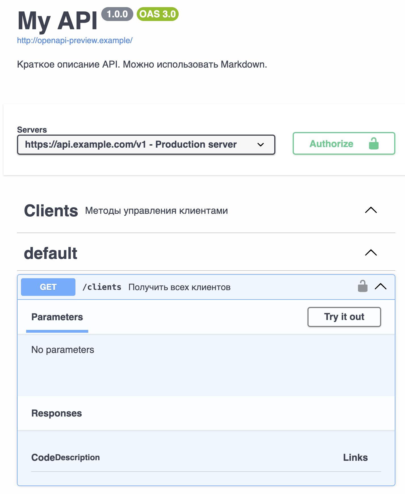
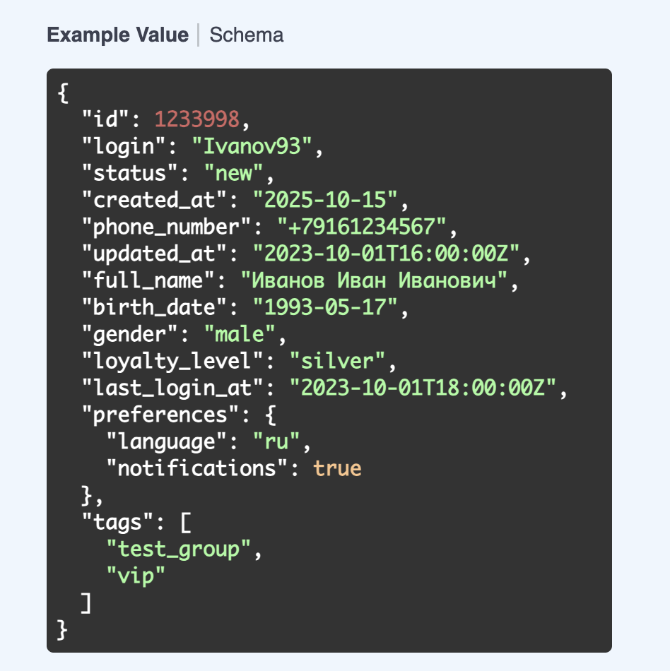

# Краткое описание компонентов openAPI
## Основная структура
Основная структура приводится в листинге. Комментарии описывают назначение каждого компонента:
```yaml
openapi: 3.0.3  # версия спецификации OpenAPI (используется 3.0.0 – 3.0.3)
info:           # информация об API
  title: My API
  version: 1.0.0
  description: |
    Краткое описание API. Можно использовать Markdown.
servers:        # список базовых URL, на которых доступно API
  - url: https://api.example.com/v1
    description: Production server
tags:           # логические группы операций
  - name: Clients
    description: Методы управления клиентами
security:       # глобальные схемы авторизации
  - basicAuth: []

paths:          # маршруты API с методами, параметрами и ответами
  /clients:
    get:        # метод GET
      summary: Получить всех клиентов
      parameters: []  # query/path/header параметры
      responses: {}   # ответы по коду

components:     # переиспользуемые элементы
  schemas: {}           # модели данных
  parameters: {}        # параметры (например, заголовки)
  responses: {}         # шаблонные ответы
  requestBodies: {}     # тела запросов
  headers: {}           # переиспользуемые заголовки
  securitySchemes: {}   # схемы авторизации
```
В интерфейсе API будет выглядеть вот так:

## Блок components
### schemas
Schema – модель объекта. Используется для описания структуры входных и выходных данных. Ниже описана схема для Клиента.
```yaml
schemas:
  Client:
    type: object
    required: [id, login]
    properties:
      id:
        type: integer
        example: 1001
      login:
        type: string
        example: user123
```
Описание структуры может включать в себя:
- type
    - string
    - number
    - boolean
    - integer
    - array
    - object
- format - Дополнительный формат для типа (дата, UUID, email и другие)
    - email
    - date
    - date-time
    - uuid
    - uri
    - float / double (Для number)
    - int32 / int64 (Для integer)
- enum – Список допустимых значений
- pattern – Регулярное выражение для валидации строк
- example – Пример значения
- minimum, maximum – Ограничения для числовых диапазонов  
Для композиции схем можно использовать:
- allOf – объединяет свойства нескольких схем
- oneOf – объект должен соответствовать одной из схем
- anyOf - объект может соответствовать одной или нескольким схемам
- not – прямой запрет на использование
- additionalProperties – При false запрещает поля, не указанные в properties  
Для работы с массивами (type: array)
- items -  Схема одного элемента
- minItems, maxItems - Минимальное и максимальное количество элементов в массиве
- uniqueItems - Все элементы должны быть уникальны
Как это выглядит на примере описания схемы для клиента:
```yaml
Client:
    type: object
    required:
    - id
    - login
    - status
    - created_at
    properties:
    id:
        description: "Идентификатор пользователя во внутренней системе"
        type: integer
        minimum: 0
        example: 1233998
    login:
        description: "Логин клиента, с которым он зарегистрировался на сайте"
        type: string
        example: Ivanov93
    status:
        type: string
        enum: [new, heavy, light]
        description: "Статус личного кабинета пользователя"
    created_at:
        type: string
        format: date
        description: "Дата регистрации пользователя"
    phone_number:
        type: string 
        pattern: '^\\+7\\d{10}$'
        example: "+79161234567"
        description: "Номер телефона в формате +7XXXXXXXXXX"
ClientExtended:
    allOf:
    - $ref: '#/components/schemas/Client'
    - type: object
    properties:
        updated_at:
        type: string
        format: date-time
        description: "Дата последнего обновления профиля"
        example: "2023-10-01T16:00:00Z"
        full_name:
        type: string
        description: "ФИО клиента"
        example: "Иванов Иван Иванович"
        birth_date:
        type: string
        format: date
        description: "Дата рождения"
        example: "1993-05-17"
        gender:
        type: string
        enum: [male, female, other]
        example: "male"
        description: "Пол клиента"
        loyalty_level:
        type: string
        enum: [bronze, silver, gold, platinum]
        description: "Уровень лояльности"
        example: "silver"
        last_login_at:
        type: string
        format: date-time
        example: "2023-10-01T18:00:00Z"
        description: "Дата последнего входа"
        preferences:
        type: object
        description: "Настройки клиента"
        properties:
            language:
            type: string
            example: "ru"
            notifications:
            type: boolean
            example: true
        tags:
        type: array
        items:
            type: string
        description: "Метки клиента"
        example: ["test_group", "vip"]
```
В интерфейсе это выглядит так:


### parameters
Переиспользуемые параметры (заголовки, параметры запроса и пути). Могут переиспользоваться в paths, methods или на уровне всего пути.
```yaml
parameters:
  X-Request-Id:
    name: X-Request-Id
    in: header # Может быть path, query
    required: false
    schema:
      type: string
    description: ID запроса
```

### responses
Шаблоны для HTTP-ответов. Можно использовать для стандартизации повторяющихся ответов (например, 404, 401, 500)
```yaml
responses:
  NotFound:
    description: Ресурс не найден
    content:
      application/json:
        schema:
          $ref: '#/components/schemas/Error'
```
### requestBodies
Шаблоны тела для запроса
```yaml
requestBodies:
  ClientCreateRequest:
    description: Новый клиент
    required: true
    content:
      application/json:
        schema:
          $ref: '#/components/schemas/Client'
```

### headers
Переиспользуемые заголовки ответа
``` yaml
headers:
  X-Rate-Limit-Remaining:
    description: Остаток лимита запросов
    schema:
      type: integer
```
### securitySchemas – способы авторизации
```yaml
securitySchemes:
  basicAuth:
    type: http
    scheme: basic

  bearerAuth:
    type: http
    scheme: bearer
    bearerFormat: JWT

  apiKeyAuth:
    type: apiKey
    in: header
    name: X-API-Key
```
## paths
Основа openAPI. Каждый маршрут (/path) описывает:
- методы
- параметры
- тело запроса
- ответы
- авторизация
- теги
### Теги
Позволяют разделить методы по логическим группам, будут разделены в SwaggerUI
```yaml
tags:
  - name: Orders
    description: Методы для работы с заказами
```
### externalDocs
Позволяют ссылаться на внешнюю документацию (Например, полная спецификация метода)
```yaml
externalDocs:
  description: Полная документация
  url: https://docs.example.com
```

## Пример
Посмотреть на пример описания нескольких методов можно в [файле](openAPI_example.yaml)

