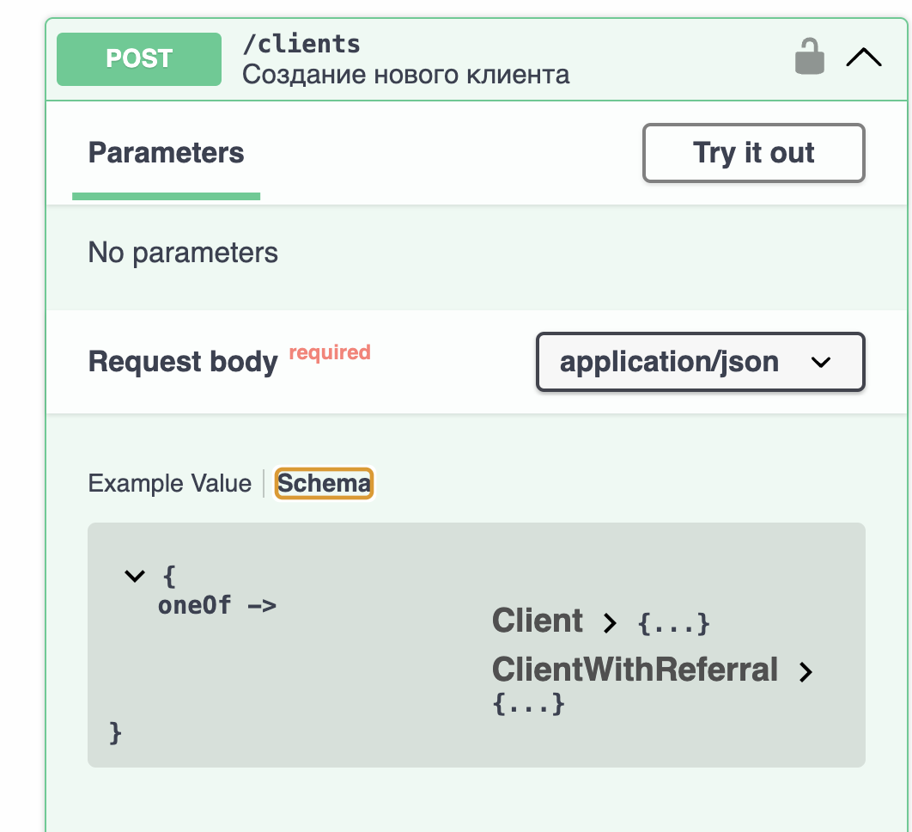
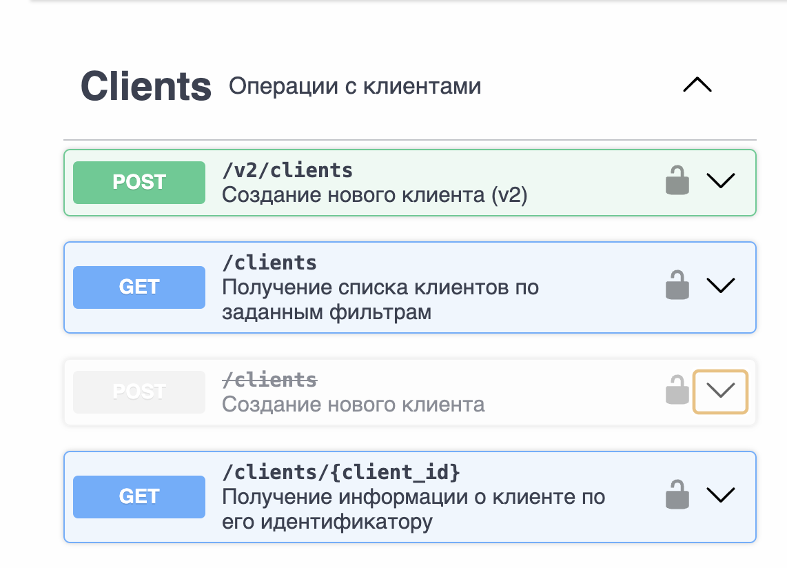

# Шаг 4. Версионирование
## Задание на лабораторную работу
- Скопируйте свою спецификацию в директорию `steps/step_4/execution`.
- Представьте, что сервис развивается и в API нужны изменения.
- Скопируйте спецификацию и создайте версию v2 (например, `openapi_v2.yaml`).
- Внесите изменения и сохраните файл:
    - Измените один из методов так, чтобы изменение было совместимым (backward/forward compatible).
    - Добавьте новый метод, а старый пометьте `deprecated: true`.
- Скопируйте из `steps/step_3/description` файлы для FastAPI (или используйте свой код приложения).
- С помощью LLM обновите обработчики так, чтобы соответствовали изменённой спецификации.
- Проверьте работоспособность обеих версий.

## Пример выполнения
Реализовать версионирование при проектировании API можно несколькими способами:
- Добавление необязательных полей в запрос и ответ
- Создание новой версии метода
При изменении контракта (а именно этим и является изменение методов) по возможности необходимо сохранять прямую и обратную совместимость. Это даст возможность потребителям использовать разные версии приложения без доработок на своей стороне.
При разработке апи стоит придерживаться принципа робастности: "будьте консервативны в том, что вы отправляете, и либеральны в том, что принимаете". Это означает, что ваш API должен соответствовать спецификациям при отправке данных, но при получении данных он должен быть способен принимать и обрабатывать различные, даже нестандартные входные данные, пока их смысл ясен. Цель этого принципа — обеспечить совместимость и гибкость системы, позволяя ей лучше работать с ошибками и вариациями данных. 
В openAPI мы можем реализовать изменение контрактов с помощью схем oneOf/anyOf или с помощью добавления новой версии метода.   
Полезно помечать методы, которые выводятся из обращения, как deprecated, чтобы потребители видели изменение и готовились к миграции заранее.
В нашем примере мы изменим API дважды: с совместимым изменением и без него.
Для первого изменения создадим файл [openAPI_example_v1_1.yaml](./openAPI_example_v1_1.yaml) и изменим метод создания клиента. Допустим, что при создании клиента мы хотим указывать еще и реферальный код, по которому он пришел, чтобы давать бонусы пригласившему человеку. Можно сделать это двумя способами: изменение текущей схемы Client (добавление нового поля) или использование oneOf. Воспользуемся вторым способом. Не забудем изменить версию API на 1.1 (было изменение  функциональности, но оно совместимое). Теперь потребители смогут пользоваться одним из вариантов
```yaml
application/json:
    schema:
        oneOf:
        - $ref: '#/components/schemas/Client'
        - $ref: '#/components/schemas/ClientWithReferral'
```
Теперь наш контракт выглядит вот так:

А теперь давайте предположим, что мы хотим внести несовместимые изменения (добавить обязательное поле email, переименовать поле created_at → registration_date, изменить значения допустимые значения статусов). Да, некоторые изменения можно сделать совместимыми, добавив доп логику на стороне обработчика (маппинг названий полей и маппинг статусов), но предположим, что поле email в любом случае стало обязательным.
Сделаем новую схему для клиента:
```yaml
    ClientV2:
      type: object
      required:
        - login
        - email
        - status
        - registration_date
      properties:
        login:
          type: string
          minLength: 5
          maxLength: 30
          example: NewUser2025
        email:
          type: string
          format: email
          example: new.user@example.com
        status:
          type: string
          enum: [new, active, suspended]
        registration_date:
          type: string
          format: date
        phone_number:
          type: string
          pattern: '^\\+7\\d{10}$'
          example: "+79998887766"
        preferences:
          type: object
          properties:
            language:
              type: string
              enum: [ru, en]
              example: ru
            marketing_consent:
              type: boolean
              default: false
```
и добавим новый метод /v2/clients:
```yaml
  /v2/clients:
    post:
      tags:
        - Clients
      summary: Создание нового клиента (v2)
      requestBody:
        required: true
        content:
          application/json:
            schema:
              $ref: '#/components/schemas/ClientV2'
      responses:
        '201':
          description: Клиент v2 успешно создан
          content:
            application/json:
              schema:
                $ref: '#/components/schemas/ClientV2'
        '400':
          description: Ошибка валидации входных данных
          content:
            application/json:
              schema:
                $ref: '#/components/schemas/ProblemDetails'
        '409':
          description: Конфликт — логин или email уже существует
          content:
            application/json:
              schema:
                $ref: '#/components/schemas/ProblemDetails'
        '401':
          description: Unauthorized — требуется авторизация
```
В старый метод добавим deprecated: true. Не забудем поправить версию API на 2.0, тк произошли несовместимые изменения.
Теперь наш контракт в SwaggerUI выглядит вот так:


## Контрольные вопросы
- Какие изменения считаются backward‑compatible, forward‑compatible и breaking?
- Какие подходы к версионированию вы знаете (URI, заголовки, медиатипы)?
- В каких случаях помечать методы `deprecated: true` и зачем?
- Как поддерживать две версии API одновременно и не нарушать контракты?
- Какие риски у breaking‑изменений для потребителей вашего API?
